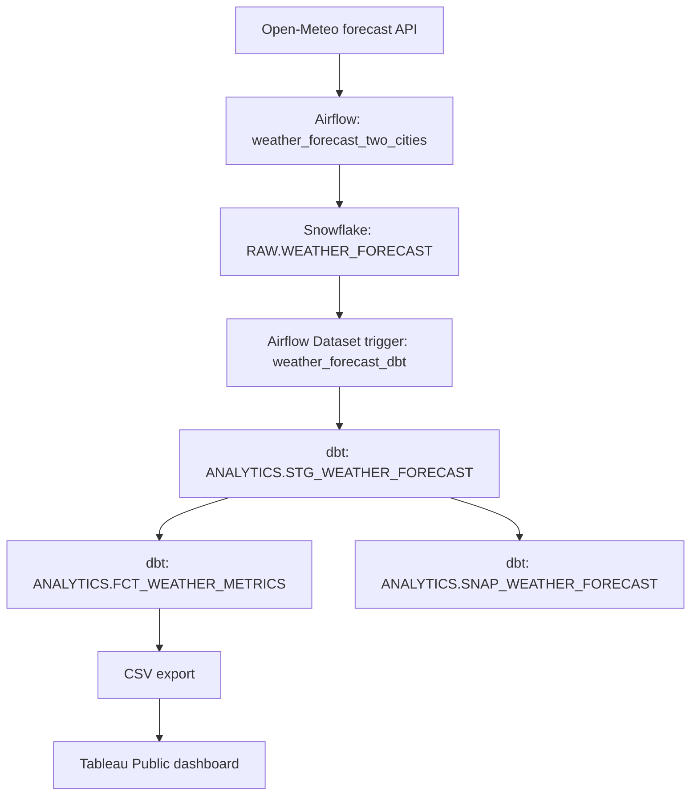

# Weather Forecast Analytics

DATA 226 lab using Open-Meteo, Airflow, Snowflake, dbt, and Tableau Public to
compare 14-day forecasts for San Jose and Bakersfield. The project is separate
from the older historical-weather `hw_3.py` DAG and `RAW.WEATHER_DATA` table.

## Architecture



The ETL runs daily at 08:00 America/Los_Angeles (`catchup=False`). Its
successful load emits an Airflow Dataset event, starting the dbt DAG. The dbt
tasks run `dbt run`, `dbt test`, and `dbt snapshot` in that order.

## Repository layout

| Path | Purpose |
| --- | --- |
| `dags/weather_forecast_etl.py` | Fetches and validates both cities; transactionally merges forecasts. |
| `dags/weather_forecast_dbt.py` | Dataset-triggered dbt run, test, and snapshot tasks. |
| `dbt/weather_forecast/dbt_project.yml` | Project settings and model materializations. |
| `dbt/weather_forecast/profiles.yml` | Snowflake profile using environment variables, with no stored password. |
| `dbt/weather_forecast/models/staging/stg_weather_forecast.sql` | Staging view and city-date key. |
| `dbt/weather_forecast/models/marts/fct_weather_metrics.sql` | Forecast analytics table for Tableau. |
| `dbt/weather_forecast/models/schema.yml` | Source and model data tests. |
| `dbt/weather_forecast/tests/assert_nonnegative_precipitation.sql` | Singular data test. |
| `dbt/weather_forecast/snapshots/snap_weather_forecast.sql` | Forecast revision history. |
| `report/lab_report.md` | Report with evidence placeholders. |

## Data products and metrics

`DATA_226.RAW.WEATHER_FORECAST` stores the current forecast for each city
and forecast date. `STG_WEATHER_FORECAST` is a dbt view with a derived
`CITY_DATE_KEY`. `FCT_WEATHER_METRICS` is a dbt table containing:

| Field | Meaning |
| --- | --- |
| `ROLLING_7D_MAX_TEMP_C` | Mean maximum temperature for the current and up to six preceding forecast dates. |
| `ROLLING_7D_PRECIPITATION_MM` | Sum of forecast precipitation over the same window. |
| `TEMP_ANOMALY_C` | Daily maximum minus its rolling mean, not a historical-climate anomaly. |
| `DRY_SPELL_DAYS` | Consecutive days with forecast precipitation below 1 mm; resets on a wet day. |

The first six rolling windows are partial. The dbt check-strategy snapshot
records a new version when weather code, maximum or minimum temperature, or
precipitation changes. It needs runs before and after a revision to retain
both versions. These are analytics of API forecasts, not predictions from a
separately trained model.

## Idempotency and validation

The ETL fetches and validates both cities before writing. It inserts the
incoming rows into a temporary Snowflake table and runs a change-sensitive
`MERGE` within `BEGIN`/`COMMIT`, with `ROLLBACK` on error. Matching uses
`(CITY, FORECAST_DATE)`: identical reruns leave the row and
`LAST_CHANGED_AT` unchanged; changed forecasts are updated. The ETL limits
active runs to one and produces one source row per city and date. A primary
key is declared on the Snowflake standard table but is not enforced there.

dbt checks keys for uniqueness and non-null values, validates other required
columns, and rejects negative precipitation. The Tableau Public dashboard
uses a CSV export of `FCT_WEATHER_METRICS`; refreshing it requires a new
export after the pipeline runs.

## Reproducing the pipeline

The Docker Compose setup mounts host `dags/` at `/opt/airflow/dags` and host
`dbt/` at `/opt/airflow/dbt`; it includes Airflow 2.10.1, the Snowflake
provider, and dbt-snowflake. Place the two DAG files and the entire
`dbt/weather_forecast/` directory in those mounts.

1. Configure Airflow connection `snowflake_acc_data220` with Snowflake
   account, user, password, `DATA_226` database, warehouse, and a role with
   RAW read/write and ANALYTICS object-creation privileges. Keep secrets out
   of Git.
2. Create Airflow Variable `weather_cities` as JSON:

   ```json
   [
     {"name": "San Jose", "latitude": 37.3382, "longitude": -121.8863},
     {"name": "Bakersfield", "latitude": 35.3733, "longitude": -119.0187}
   ]
   ```

3. Start the existing Docker Compose stack, unpause both weather DAGs, and
   trigger `weather_forecast_two_cities`. After `load_forecast` succeeds,
   verify a `dataset_triggered__` run of `weather_forecast_dbt` with all
   three tasks green. Task logs show the dbt command output.
4. Export `DATA_226.ANALYTICS.FCT_WEATHER_METRICS` as CSV. The Tableau
   dashboard displays daily maximum temperature, seven-day moving average,
   seven-day rainfall, and predicted dry-spell length by city, with a
   forecast-date filter.

## Verification queries

```sql
SELECT CITY, COUNT(*) AS FORECAST_DAYS,
       MIN(FORECAST_DATE) AS FIRST_DAY, MAX(FORECAST_DATE) AS LAST_DAY
FROM DATA_226.RAW.WEATHER_FORECAST
GROUP BY CITY ORDER BY CITY;

SELECT CITY, FORECAST_DATE, TEMPERATURE_MAX_C,
       ROLLING_7D_MAX_TEMP_C, TEMP_ANOMALY_C,
       ROLLING_7D_PRECIPITATION_MM, DRY_SPELL_DAYS
FROM DATA_226.ANALYTICS.FCT_WEATHER_METRICS
ORDER BY CITY, FORECAST_DATE;

SELECT CITY, FORECAST_DATE, DBT_VALID_FROM, DBT_VALID_TO
FROM DATA_226.ANALYTICS.SNAP_WEATHER_FORECAST
ORDER BY CITY, FORECAST_DATE, DBT_VALID_FROM;
```

On the observed October 1, 2026 run, the RAW table held 14 forecast dates
per city (28 rows), October 1–14. Forecast precipitation was 0 mm for both
cities across that period; the dashboard's rainfall lines overlap at zero.
These forecast values may change on later runs.

## Report and evidence

`report/lab_report.md` covers the problem, requirements, architecture,
table structures, implementation, dashboard, future work, and references.
The completed submission report should contain Airflow DAG, connection, and
variable screenshots (with credentials hidden), dbt run/test/snapshot output,
Snowflake results, and at least two Tableau dashboard screenshots showing
different date selections. Save evidence in `report/screenshots/` with
descriptive names.

## References

- [Open-Meteo Forecast API](https://open-meteo.com/en/docs)
- [Apache Airflow documentation](https://airflow.apache.org/docs/apache-airflow/2.10.1/)
- [dbt snapshots](https://docs.getdbt.com/docs/build/snapshots)
- [Snowflake MERGE](https://docs.snowflake.com/en/sql-reference/sql/merge)
