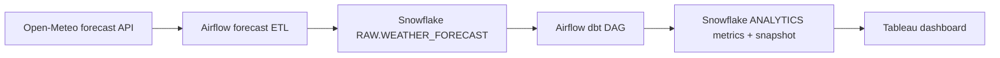

# DATA 226 — Weather Forecast Analytics

Open-Meteo daily forecasts for San José and Bakersfield flow through Airflow,
Snowflake, dbt, and Tableau. This lab builds on `hw_3.py`; it leaves the existing
`DATA_226.RAW.WEATHER_DATA` historical/archive table and DAG untouched.



## Fit with your Docker Compose

Your existing Compose file already mounts host `dags/` at `/opt/airflow/dags`
and host `dbt/` at `/opt/airflow/dbt`, and installs dbt-snowflake. **No Compose
change is needed.** Copy the two Python files in this project's `dags/` into
your existing host `dags/` folder. Copy the `dbt/weather_forecast/` directory
into your existing host `dbt/` folder. Keep your existing dbt project and
`hw_3.py` where they are. Both DAGs use your existing connection ID
`snowflake_acc_data220`.

## Configure and run

1. In Snowflake, confirm `DATA_226.RAW` and `DATA_226.ANALYTICS` exist and your
   Airflow Snowflake role can create tables/views in them. The ETL creates its
   own RAW table; dbt creates its models and snapshot in ANALYTICS. Your older
   RAW.WEATHER_DATA table is not modified.
2. In Airflow **Admin → Variables**, create `weather_cities` as this JSON:

   ```json
   [
     {"name":"San Jose","latitude":37.3382,"longitude":-121.8863},
     {"name":"Bakersfield","latitude":35.3733,"longitude":-119.0187}
   ]
   ```

   This new DAG calls `https://api.open-meteo.com/v1/forecast` directly; the old
   `weather_api_url` and `api_params` variables remain available to `hw_3.py`.
3. From your existing Airflow Compose directory run `docker compose up -d`.
   Open Airflow at http://localhost:8081. Unpause
   `weather_forecast_two_cities` and `weather_forecast_dbt`; trigger the ETL
   once. The dbt DAG starts from the dataset event **after a successful load**.
   The ETL normally runs daily at 08:00 Los Angeles time; the dbt DAG has no
   separate clock schedule.
4. Inspect both DAGs in the Airflow Grid/Graph UI. In Snowflake, verify:

   ```sql
   SELECT city, COUNT(*) AS forecast_days, MIN(forecast_date) AS first_day,
          MAX(forecast_date) AS last_day
   FROM DATA_226.RAW.WEATHER_FORECAST GROUP BY city ORDER BY city;

   SELECT city, forecast_date, temperature_max_c, rolling_7d_max_temp_c,
          temp_anomaly_c, rolling_7d_precipitation_mm, dry_spell_days
   FROM DATA_226.ANALYTICS.FCT_WEATHER_METRICS
   ORDER BY city, forecast_date;

   SELECT city, forecast_date, dbt_valid_from, dbt_valid_to
   FROM DATA_226.ANALYTICS.SNAP_WEATHER_FORECAST
   ORDER BY city, forecast_date, dbt_valid_from;
   ```

5. For explicit dbt command screenshots, run inside the Airflow service:

   ```bash
   docker compose exec airflow bash
   cd /opt/airflow/dbt/weather_forecast
   ```

   dbt needs `SNOWFLAKE_ACCOUNT`, `SNOWFLAKE_USER`, `SNOWFLAKE_PASSWORD`,
   `SNOWFLAKE_DATABASE`, `SNOWFLAKE_WAREHOUSE`, and `SNOWFLAKE_ROLE` in that
   interactive shell. The dbt DAG derives them from the existing Airflow
   Snowflake connection automatically. You can use the dbt DAG task logs as
   screenshots without entering credentials into a shell.

## Idempotency and forecast semantics

The loader fetches both cities before modifying Snowflake. It inserts all
responses into a session-local temporary table and `MERGE`s in one transaction.
The key is `(CITY, FORECAST_DATE)`. Repeating an identical forecast neither
duplicates rows nor updates `LAST_CHANGED_AT`. When a forecast changes, its
current value is updated and a later dbt snapshot run retains its prior value.
Snapshot changes are visible only if snapshots run both before and after a
forecast revision. Standard Snowflake primary keys are metadata rather than
an enforcement mechanism; serial Airflow runs and unique source rows matter.

Forecast metrics describe **predicted weather**, not observed weather.
`rolling_7d_max_temp_c` and `rolling_7d_precipitation_mm` use the current day
and at most six prior forecast dates, so the first six dates use partial
windows. `temp_anomaly_c` is daily maximum minus that rolling maximum average,
not an anomaly relative to historical climate. `dry_spell_days` counts
consecutive forecast days with precipitation below 1 mm, resetting at 1 mm.

## Tableau dashboard

Connect Tableau to Snowflake `DATA_226.ANALYTICS.FCT_WEATHER_METRICS` using a
Snowflake account with read access. Build a two-city daily maximum temperature
line chart (add the rolling average), a precipitation chart (daily and rolling
seven-day sum), and a dry-spell chart. Put `City` and `Forecast Date` on visible
filters. Capture separate screenshots of each chart plus at least two dashboard
screenshots with different forecast-date selections. The submitted report
template is in `report/lab_report.md`.

## Evidence and submission

Capture the Airflow ETL and dbt DAG graphs and logs, Airflow connection and
variable configuration **with credentials hidden**, dbt run/test/snapshot
success, Snowflake schema/table views, Tableau dashboard states, and GitHub
repository URL. Save screenshots under `report/screenshots/` before exporting
the report to PDF. Do not claim the dashboard or runs are complete until those
screenshots exist. Repo files: `dags/`, `dbt/`, `report/`, and this README.
