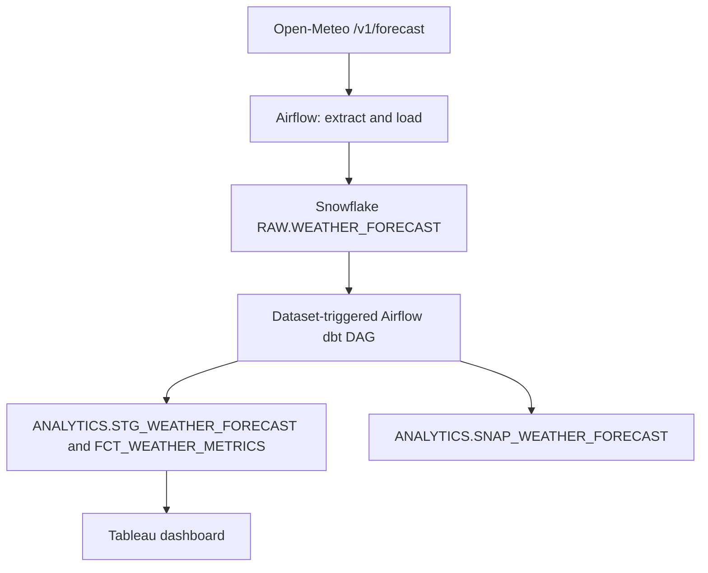

# DATA 226 Lab Report — Building Weather Prediction Analytics

**Student:** Diljot Singh  
**Repository:** [Add your GitHub repository link]  
**Date:** [Add submission date]

## Problem statement

Compare the next 14 forecast days for San José and Bakersfield. Turn raw daily
predictions into interpretable temperature and rainfall trends, and track
forecast revisions over time.

## Requirements and specifications

The source is Open-Meteo `/v1/forecast`, queried daily for two California
cities. Airflow 2.10.1 schedules extraction and loads Snowflake. dbt transforms
the raw source, tests the records, and snapshots changed forecasts. Tableau
visualizes the forecast metrics. The SQL loader uses a transaction and a
change-sensitive MERGE to keep reruns idempotent.

## System design and data flow

## Table structures

| Table | Grain and keys | Fields and data types | Constraints / behavior |
| --- | --- | --- | --- |
| `RAW.WEATHER_FORECAST` | City + forecast date | `CITY VARCHAR(100)`, `FORECAST_DATE DATE`, `LATITUDE/LONGITUDE NUMBER(10,7)`, `WEATHER_CODE INTEGER`, `TEMPERATURE_MAX_C/TEMPERATURE_MIN_C/PRECIPITATION_MM FLOAT`, `LAST_CHANGED_AT TIMESTAMP_NTZ` | City, date, coordinates, and change time NOT NULL; declared composite primary key (not enforced by standard Snowflake tables); MERGE updates changed forecast values only. |
| `ANALYTICS.STG_WEATHER_FORECAST` | City + forecast date | Source columns, plus `CITY_DATE_KEY VARCHAR` | dbt view; unique/not-null test on derived key. |
| `ANALYTICS.FCT_WEATHER_METRICS` | City + forecast date | Stage fields plus `ROLLING_7D_MAX_TEMP_C FLOAT`, `ROLLING_7D_PRECIPITATION_MM FLOAT`, `DRY_SPELL_DAYS NUMBER`, `TEMP_ANOMALY_C FLOAT` | dbt table; key and metric tests. |
| `ANALYTICS.SNAP_WEATHER_FORECAST` | City + forecast date + version | Forecast values plus `DBT_SCD_ID`, `DBT_UPDATED_AT`, `DBT_VALID_FROM`, `DBT_VALID_TO` | dbt check-strategy snapshot; captures revised forecasts on subsequent runs. |
| `RAW.WEATHER_FORECAST_BATCH` | One forecast row in current load | Same incoming weather fields without change time | Temporary per-connection staging table used within the ETL transaction. |

## Airflow implementation and evidence

`dags/weather_forecast_etl.py` fetches 14 daily forecasts for each city and
MERGEs them into Snowflake. On SQL error it rolls back and raises the exception.
`dags/weather_forecast_dbt.py` is triggered only after ETL success and runs
`dbt run`, `dbt test`, and `dbt snapshot` in order.

- [Insert ETL DAG screenshot and dbt DAG screenshot.]
- [Insert Airflow connection screenshot with credentials hidden.]
- [Insert `weather_cities` variable screenshot.]
- [Insert successful ETL load log and repeat-run row count evidence.]

## dbt models, tests, and snapshot

`STG_WEATHER_FORECAST` standardizes the source; `FCT_WEATHER_METRICS` computes
rolling temperature, temperature deviation, rainfall, and dry-spell length.
Generic unique/not-null tests and a singular nonnegative precipitation test
validate the output. The snapshot records changed forecast values.

- [Insert successful dbt run, test, and snapshot logs/screenshots.]
- [Insert the Snowflake model and snapshot inspection screenshot.]

## BI dashboard

**Purpose:** Compare predicted conditions across two cities and identify
warm or dry stretches in the next 14 forecast days. **Dataset:**
`DATA_226.ANALYTICS.FCT_WEATHER_METRICS`. **Usage:** Select a city or date
range and examine daily temperature, rolling temperature, precipitation, and
dry-spell days.

- [Insert clearly legible separate chart screenshots.]
- [Insert dashboard screenshot with date range A.]
- [Insert dashboard screenshot with different date range B.]

## Results and limitations

[After running the pipeline, add actual observations with city and date.
Explain that forecast values may revise, that the first six rolling windows
are partial, and that this is not a validated prediction model.]

## Future work

Compare forecast against observed weather to measure error, add more cities,
and notify users when a forecast changes substantially.

## Conclusion

[Add an evidence-based conclusion after inspecting your actual charts.]

## References

- Open-Meteo Forecast API: https://open-meteo.com/en/docs
- Apache Airflow documentation: https://airflow.apache.org/docs/apache-airflow/2.10.1/
- dbt documentation: https://docs.getdbt.com/docs/build/snapshots
- Snowflake MERGE: https://docs.snowflake.com/en/sql-reference/sql/merge
